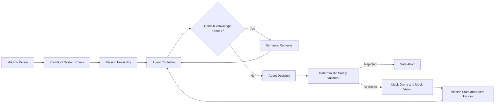

# Evidence-Driven Semantic Drone Inspection Agent

## Overview

This project simulates an autonomous drone inspecting Solar Panel Area A.
It collects visual evidence, detects a possible anomaly, asks a small semantic knowledge base for guidance when evidence is weak, re-plans, verifies the finding, returns safely, and writes an explainable report.

The implementation deliberately favors transparent control logic and deterministic tests over an agent framework or real flight infrastructure.

## Run

```bash
uv sync
uv run python -m app.main
uv run python -m app.main --scenario preflight_failure
uv run pytest
```

The default demo is deterministic: the first camera capture times out, the retry succeeds, confidence is 0.46, re-inspection produces 0.93, and the drone returns to base. The failure scenario disables the navigation controller before takeoff.

Other scenarios: `--scenario low-battery` (pre-flight battery failure → safe abort before any movement). Free-text missions are supported via a mock NLP seam: `uv run python -m app.main --mission "Inspect the north solar field; return when battery hits 45%"`. The parser proposes target/capabilities/constraints; the guardrails still enforce them. Tool calls run under a watchdog, so a hung tool becomes a normal failure observation.

## Documentation

Full documentation lives in **[`docs/`](docs/README.md)**:

- [Overview & index](docs/README.md)
- [Architecture](docs/architecture.md) components, diagram, and why this shape was chosen
- [Agentic workflow](docs/agentic-workflow.md) Mission → Plan → Observe → Decide → Act → Verify → Re-plan → Complete mapped to code
- [Design decisions](docs/design-decisions.md) what, why, alternatives considered, trade-offs
- [Failure handling & safety](docs/failure-handling-and-safety.md) failure catalog, guardrails, stop conditions
- [Ownership: the decision core](docs/ownership.md) deep dive on internals, failure modes, debugging, scaling
- [Demo guide](docs/demo-guide.md) scenarios, expected traces, talking points
- [Module reference](docs/module-reference.md) file-by-file inputs/outputs
- [Limitations & roadmap](docs/limitations-and-roadmap.md) known debts and v2 plan

## Mission and workflow

`MissionParser` (or the mock-LLM `NLPMissionParser` for free text) creates mission requirements and context. The planner creates an initial proposal, not a script. The controller repeatedly observes state, interprets observations, decides whether knowledge is needed, retrieves policy when appropriate, proposes a decision, validates executable actions, executes tools, and updates state:

`Mission → Plan → Observe → Interpret → Decide → Validate → Act → Verify → Re-plan → Complete`



## Architecture boundaries

- Pre-flight asks: “Can this platform safely start this mission?” It checks GPS, battery, camera, navigation controller, and geofence.
- Mission feasibility confirms the required capabilities are available before execution.
- The agent asks: “Given current state and observations, what should happen next?” Decisions include retry, re-inspect, verify, return, and abort.
- Safety asks: “Is this executable action allowed?” It is deterministic and independent of semantic retrieval.
- Tools execute only approved `ActionType` values. `Re-inspect` and `Retry Capture` are agent decisions, not physical tools.

## Component ownership: Agent Controller and evidence-gated decision logic

This is the one component I fully own. It is intentionally small enough to explain line by line in `app/agent/controller.py`.

Its inputs are the current `MissionState`, the latest `ToolObservation`, `MissionPolicy`, the proposal from `MissionPlanner`, and semantic results when the current interpretation needs domain guidance. Its outputs are an `AgentDecision` with a reason and, when physical execution is needed, an `AgentAction`. Only that action is sent to the safety validator.

Internally, `_decide` reads state rather than advancing a fixed index. `_apply_decision` records the decision, changes the plan or mission state, and dispatches executable actions. `_execute` validates first, calls one tool, records the observation, and sends the next cycle back through `_decide`.

Tools can fail, retrieval can be unavailable, safety can reject an action, or the controller can exhaust its step/retry budget. Failures are recorded in mission memory. Camera failures use a bounded retry; weak evidence uses a bounded inspection path; unsafe conditions abort or return safely.

I considered a behavior tree, multiple agents, an LLM planner, and a fixed script. The first three add complexity or reduce determinism for this mission; the script cannot demonstrate observation-dependent recovery. The current design keeps policy and safety deterministic while leaving the controller’s decision boundary explicit.

To debug it, inspect the ordered `MissionState.history`, decisions, failures, confidence history, plan history, and safety decisions; inject fake tools; reproduce one transition with a unit test; then run the CLI trace. To scale it, preserve the controller contract while adding persistent events, real tool adapters, and versioned policies behind interfaces.

## Pre-flight system check

`PreFlightSystemCheck` runs five structured checks and records every result. GPS, battery, camera, navigation, and geofence are critical for this mission. A critical failure prevents the controller from issuing movement commands. Camera initialization is represented separately so a future recoverable initialization retry can be added without weakening the readiness boundary.

The failure demo produces `[FAIL] Navigation Controller`, `Mission Readiness: Not Ready`, an abort decision, and no movement command.

## Evidence-gated decisions

The single policy threshold is `EVIDENCE_THRESHOLD = 0.70`. A first detection at 0.46 cannot be confirmed. The controller retrieves inspection SOP, anomaly guidance, and area history, then changes the plan from capture/detect/verify to additional capture/detect/verify. A later 0.93 observation passes the threshold and permits verification.

This is not a branch hard-coded around 0.46 or 0.93; the decision is based on the configured threshold and current mission state.

## Semantic RAG

The static knowledge base contains `inspection.txt`, `anomaly.txt`, and `history.txt`. The sentence-transformers model is loaded once per retriever and performs in-memory cosine-similarity search. That is sufficient for three small, static documents and avoids needless vector-database infrastructure.

RAG answers what policy and domain guidance recommend. `MissionState` answers what happened during this flight: status, location, battery, evidence, confidence history, failures, retries, decisions, safety results, and events. RAG is consulted only for the low-confidence interpretation; it is not called for every tool operation and it never executes actions.

## Failure handling and safety

Tool failures are observations, not unhandled exceptions. A camera timeout is recorded, `camera_retries` is incremented independently from `inspection_attempts`, and the controller retries only within the configured limit. Exhaustion leads to safe return when possible or abort. Safety rejects navigation without readiness, navigation with low battery, capture at base, detection without evidence, and capture beyond the retry budget. The agent cannot override those rules.

The governing principle is: **The agent proposes what to do; deterministic software decides whether it is allowed.**

## Reporting and testability

The report is generated from mission memory and includes mission, target, status, readiness, initial plan, actual decisions, evidence, finding, confidence history, failures, recovery, knowledge sources, safety decisions, final location, final battery, and a concise summary. The event history makes the camera recovery and evidence-driven re-plan auditable.

Tests cover successful and failed pre-flight checks, low battery, camera retries and retry exhaustion, evidence gating, re-inspection, verification, safety rejection, completion, abort, retrieval, reporting, and state updates.

## Project structure

`app/mission.py` parses the mission and requirements. `app/system/preflight.py` owns readiness. `app/agent/controller.py` owns the decision loop; `planner.py` creates the initial proposal and `policies.py` centralizes thresholds. `models/` contains decisions, observations, and mission memory. `safety/guardrails.py` is the deterministic execution boundary. `tools/` contains mock flight, vision, and reporting capabilities. `knowledge/` contains the retriever and domain documents. `app/tests/` tests decisions and state transitions directly. `docs/` provides deeper interview notes.

## Design decisions and future work

The mock drone keeps the system runnable without hardware. Semantic retrieval makes static policy lookup meaningful without pretending mission state is knowledge. Separate decisions and tools make the agentic boundary explicit. Pre-flight and deterministic safety provide two distinct protection layers. Retry limits prevent infinite loops. No LLM is required for the core workflow because deterministic, explainable decisions are the goal of this challenge.

Future work could add real telemetry, computer vision, persistent mission memory, human approval, richer planning, or LLM-assisted suggestions. Those are intentionally not implemented here.
