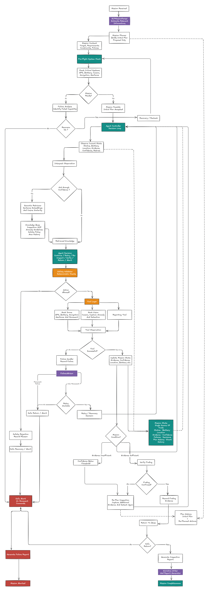

# WeevilDrone Agentic Inspection Agent — Documentation

<p align="center">
  
</p>

A small, deliberately simple agentic system for an autonomous drone inspection mission:

> *"Inspect Area A, identify a possible anomaly, collect evidence, and generate a short inspection report."*

The system receives a mission, proposes a plan, calls tools, **observes the results**, updates its state, and **changes its plan when the situation changes** — including retrying a failed camera capture and re-inspecting when detection confidence is too low. Every action passes through a deterministic safety validator before it can reach the (mocked) drone.

## Documentation Map

| Document | What it covers |
|---|---|
| [Architecture](architecture.md) | Components, data flow, architecture diagram, why this shape was chosen |
| [Full System Diagram](full-diagram.md) | One exhaustive mermaid diagram: every rule, threshold, planted behavior, and data contract |
| [Agentic Workflow](agentic-workflow.md) | How the code maps to Mission → Plan → Observe → Decide → Act → Verify → Re-plan → Complete |
| [Design Decisions](design-decisions.md) | Every important choice: what, why, alternatives considered, trade-offs |
| [Failure Handling & Safety](failure-handling-and-safety.md) | Fallback behavior, retries, guardrails, deterministic limits, stop conditions |
| [Ownership: The Decision Core](ownership.md) | Deep dive on the fully-owned component: internals, inputs/outputs, failure modes, debugging, scaling |
| [Demo Guide](demo-guide.md) | How to run every scenario, what you should see, expected console traces |
| [Module Reference](module-reference.md) | File-by-file reference: classes, key functions, inputs and outputs |
| [Limitations & Roadmap](limitations-and-roadmap.md) | What this system is *not*, and what a v2 would add |

## Quick Start

```bash
python -m app.main --scenario mission        # full demo: failure, retry, re-plan, report
python -m app.main --scenario low-battery    # deterministic pre-flight safety abort
python -m app.main --scenario preflight_failure  # navigation unavailable → abort
python -m app.main --mission "Inspect the north solar field and take photos; return when battery hits 45%"
                                             # free-text mission via the mock NLP parser
python -m pytest app/tests -q                # unit tests
```

## The 60-Second Version

- **Agent core** (`app/agent/controller.py`) — a `while` loop that decides the next action from *current state*, never from a fixed script.
- **Tools** (`app/tools/`) — mocked drone, camera/vision, and report writer. Each tool returns a structured `ToolObservation` (success, message, data), not a raw value; every call runs under a watchdog so a hang becomes a normal failure.
- **State/Memory** (`app/models/state.py`) — one `MissionState` dataclass: battery, location, evidence, confidence, failures, decisions, full event history.
- **Safety** (`app/safety/guardrails.py`) — deterministic checks (battery thresholds, retry limits, location rules) applied *before* any tool runs. The agent cannot bypass them.
- **Knowledge (bonus)** (`app/knowledge/`) — a small semantic (RAG) retriever that the agent consults when evidence confidence is low; it informs the re-inspection decision rather than making it.
- **Mock-AI seams** (`app/mission.py`, `app/agent/advisor.py`, reporting narrative) — where a real LLM would slot in (mission understanding, failure triage, report prose), simulated with deterministic rules so the demo stays reproducible. Their output is always a proposal the guardrails still validate.
