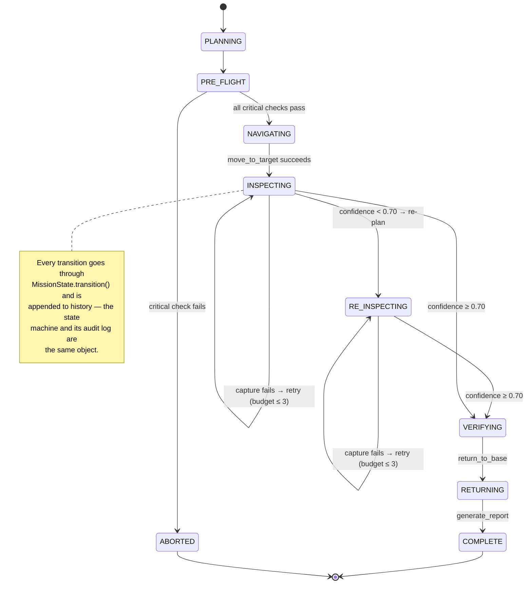

# Agentic Workflow

The challenge's canonical cycle is **Mission → Plan → Observe → Decide → Act → Verify → Re-plan → Complete**. Here is exactly where each happens in this codebase — and, more importantly, where the loop *branches*.

## The mapping

| Stage | Where in code | What actually happens |
|---|---|---|
| **Mission** | `main.py` + `MissionParser.parse()` | CLI scenario → `MissionState(missionID, target, battery)`. Requirements list (gps, battery, camera, navigation, geofence) derived from the mission. |
| **Plan** | `MissionPlanner.create_plan()` | Initial 4-step proposal; controller appends `verify_finding → return_to_base → generate_report`. Printed as "Initial Plan (Proposal)". |
| **Observe** | `call_tool()` + `update_state()` | Every tool returns `ToolObservation`. `update_state()` folds the data dict into state: battery, location, evidence ID, confidence (+ history). |
| **Decide** | `AgentController._decide()` | Pure function of current state + policy thresholds. Returns `AgentDecision` (why) with an optional `next_action` (what). |
| **Act** | `_apply_decision()` | Guardrail check → tool call. Rejections never reach the tool. |
| **Verify** | `DecisionType.VERIFY_FINDING`, guardrails | Verify is two-fold: (a) the agent verifies *evidence quality* against `EVIDENCE_THRESHOLD`, (b) the guardrails verify *action legality* before every act. |
| **Re-plan** | low-confidence branch of `_decide()` | The plan list is literally rewritten and the diff is printed and stored in `plan_history`. |
| **Complete** | `generate_report()` → `MissionStatus.COMPLETE` | Report rendered from mission memory; status `COMPLETE` or `ABORTED`, both with a printed reason. |

## The three decision points that make it agentic

### 1. Tool failure → retry (bounded)
First `capture_image` fails with "Camera Timeout". The controller does **not** rerun the script — it interprets the failure as *recoverable* (transient camera fault), increments `camera_retries`, and re-enters the loop for the same step. If the retry budget (3) were exhausted, the same branch would abort instead. Same observation, two different decisions, chosen by state.

### 2. Weak evidence → consult knowledge → re-plan
`detect_anomaly` returns confidence **0.46 < 0.70**. The controller:
1. Queries the RAG knowledge base ("what confidence is required?", "has this area had anomalies before?") — retrieval results are printed and credited in the report.
2. Rewrites the plan to `capture_image → detect_anomaly → verify_finding → return_to_base → generate_report`.
3. Returns `RE_INSPECT` with a `plan_update` diff, which is printed and recorded.

Next loop iteration executes the *new* plan: a second capture and detection return 0.93 ≥ 0.70 → `VERIFY_FINDING` → the original path resumes. Note the guardrail backstop: `CAPTURE_IMAGE` is rejected once the retry budget is gone, so even a buggy decision layer cannot loop forever.

### 3. Pre-flight failure → safe abort before movement
In `--scenario low-battery`, the battery check (15%) fails pre-flight. `mission_ready = False`, the agent aborts with the reason, and a failure report is still generated — **no movement command is ever issued**. The mission ends in a defined terminal state, not an exception.

## State machine

## Loop-termination guarantees

The loop cannot run forever:
1. `max_steps = 30` budget; exceeding it aborts with "Step budget exhausted".
2. Guardrail retry cap on `CAPTURE_IMAGE` / `DETECT_ANOMALY`.
3. Terminal states (`COMPLETE`, `ABORTED`) break the loop.
4. Non-critical decisions are never infinite: every `PROCEED` strictly progresses state (evidence grows, confidence gets re-measured, or the mission moves).

## What makes this *not* a fixed script

The initial plan and the executed decision path diverge. The report prints both — "Initial Plan" and "Actual Decision Path" — side by side as evidence of re-planning. In the demo run, the executed path includes a retry and a re-inspection that exist nowhere in the original plan.
