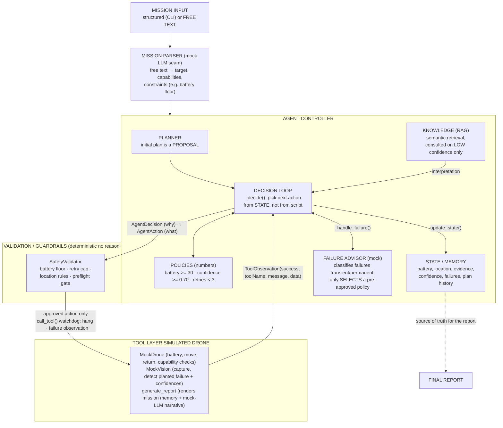

# Architecture

## One clear diagram

## Components and why they exist

### 1. Agent Controller (`app/agent/controller.py`) the brain
A loop over `max_steps` (30). Each iteration: `_decide()` picks an `AgentDecision` from **current state**; `_apply_decision()` validates it, runs the tool, updates state, and dispatches on success/failure. The controller owns all observation-dependent logic.

**Why one controller, not multiple agents?** The mission needs exactly one decision-maker with full context. Multiple agents would split state and add coordination complexity that demonstrates nothing the challenge asks for. (Deliberate choice see [Design Decisions](design-decisions.md).)

### 2. Planner (`app/agent/planner.py`) intent, not destiny
Returns an initial 4-step proposal (battery → navigate → capture → detect). The controller appends verify/return/report and treats the whole list as a **proposal**: when observations contradict it (weak evidence), the controller rewrites it. The planner is intentionally dumb the interesting planning happens *during* the mission, in the controller.

### 3. Tool Layer (`app/tools/`) mocked, but structured
`MockDrone` mutates a battery/location dict; `MockVision` simulates a planted camera timeout on the first capture and 0.46 → 0.93 confidence across detections. Both return `ToolObservation` a uniform envelope of `success / toolName / message / data`. That envelope is what makes observation-driven decisions possible: the controller never parses prose.

### 4. State / Memory (`app/models/state.py`) one source of truth
`MissionState` holds: status enum, battery, location, evidence IDs, confidence (+ full confidence history), failure list, decision list, plan + plan history, pre-flight results, and a complete event `history`. Everything the report shows is derived from this object; nothing important lives in local variables that would vanish.

Two distinct memory kinds:
- **Mission memory** what happened *this flight* (events, failures, decisions). Driving state.
- **Knowledge (RAG)** static external documents (`anomaly.txt`, `inspection.txt`, `history.txt`) retrieved semantically when confidence is low. Advisory, never authoritative.

### 5. Validation / Guardrails (`app/safety/guardrails.py`) the deterministic wall
`SafetyValidator.validate(action, state)` runs **before every tool call**. It rejects navigation on low battery, image capture at base, detection without evidence, capture when the retry budget is exhausted, and any movement for a not-ready mission. It cannot be reasoned with plain boolean logic, which is exactly the point (see [Failure Handling & Safety](failure-handling-and-safety.md)).

### 6. Pre-flight (`app/system/preflight.py`)
Before the agent loop starts, five critical capability checks (GPS, battery, camera, navigation, geofence) gate the mission. A failed critical check → `mission_ready = False` → safe abort before any movement command.

### 7. Mock-AI seams (`NLPMissionParser`, `FailureAdvisor`, report narrative)
Three places where a real LLM/ML component would slot in, each simulated with deterministic keyword rules so the demo stays offline and explainable and each keeping the same boundary: **the probabilistic component only proposes or rewords; deterministic code and guardrails still decide.**
- `NLPMissionParser` (`app/mission.py`) free-text mission → target, required capabilities, and an operator battery constraint (e.g. *"return when battery hits 45%"*). The parsed constraint changes `state.battery_floor`, but the guardrail not the parser enforces it.
- `FailureAdvisor` (`app/agent/advisor.py`) classifies a failure as transient/permanent; its answer only selects between the pre-approved retry and abort policies, and the retry budget still caps it.
- Narrative writer (`app/tools/reporting.py`) templates human-readable prose from the structured facts already in mission memory; it can never change the finding, confidence, or outcome.

## Data flow of one loop iteration

1. `_decide()` reads `MissionState` → returns `AgentDecision` (a *why*) which expands into an `AgentAction` (a *what*).
2. `SafetyValidator.validate(action, state)` → approved or rejected with a reason.
3. `call_tool(action)` → `ToolObservation` (run under a watchdog: a tool that hangs longer than `tool_timeout` becomes a failure observation, so guardrails still run).
4. `update_state(observation)` → battery, location, evidence, confidence, event log updated.
5. `_handle_success` / `_handle_failure` → state transitions (e.g. `INSPECTING`), retry, re-plan, or abort.
6. Loop repeats until `COMPLETE`, `ABORTED`, or step budget exhausted (which itself aborts).

## Why this shape (and not something else)

| Alternative | Rejected because |
|---|---|
| LLM in the decision loop | Non-deterministic, slow, and I could not defend every line of its behavior. The core decisions here are rule-based and fully explainable which is what the challenge scores. RAG is used as *advisory* knowledge instead. |
| LangChain / agent framework | The framework hides the state machine I am supposed to own. A few hundred lines of plain Python is defensible line by line. |
| Fixed script of tool calls | Explicitly insufficient: cannot respond to the camera failure or weak confidence. |
| Real simulator (pymavlink / airsim) | Environment setup risk for a laptop demo with zero added decision logic. Mocked tools return the same `ToolObservation` shape a real stack would. |
| Database-backed memory | One in-memory dataclass is enough for a single mission and is trivially inspectable in tests. |

Where real components would slot in: `MockDrone` → MAVSDK flight-controller calls, `MockVision` → an object-detection model, `NLPMissionParser` → a real LLM asked for structured JSON, `FailureAdvisor` → an LLM failure classifier the `ToolObservation` contract and the guardrail boundary stay identical. That seam is what the architecture is designed around.

