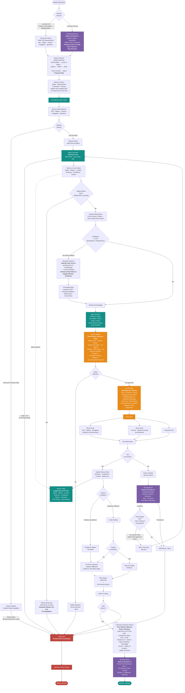

# Full System Diagram Every Single Detail

```mermaid
flowchart TD

    %% ==================== INTAKE (two entry paths) ====================
    START(["Mission Received"]) --> ENTRY{"Mission<br/>Source?"}
    ENTRY -->|"--scenario CLI<br/>mission / low-battery / preflight-failure"| STRUCTURED["Structured Parser<br/>Static Fills Requirements<br/>gps · battery · camera ·<br/>navigation · geofence"]
    ENTRY -->|"--mission free text"| NLP["NLPMissionParser<br/><b>Mock-LLM Seam #1</b><br/>Extracts Target · Capabilities<br/>Battery-Floor Constraint<br/><b>Proposes Only Can Add,<br/>Never Remove Requirements</b>"]
    STRUCTURED --> PLANNER
    NLP --> PLANNER
    PLANNER["Mission Planner<br/>Builds Initial Plan<br/>check-battery → move-to-target →<br/>capture → detect → verify →<br/>return-to-base → report<br/><b>Proposal Only</b>"]
    PLANNER --> CONTEXT["Mission Context<br/>Target · Requirements<br/>Constraints · Policies<br/>Battery Floor (default 30%<br/>or Parsed From Free Text)"]
    CONTEXT --> PREFLIGHT["Pre-Flight System Check"]

    %% ==================== PRE-FLIGHT ====================
    PREFLIGHT --> CHECKS["Check Critical Systems<br/>GPS · Battery · Camera ·<br/>Navigation · Geofence"]
    CHECKS --> READY{"Mission<br/>Ready?"}
    READY -->|"No Any of 5 Checks Fails"| FAILANALYSIS["Failure Analysis<br/>Identify Failed Capability"]
    READY -->|"Yes 5/5 PASS"| FEASIBLE["Mission Ready<br/>Initial Plan Accepted"]
    FAILANALYSIS -->|"Always Abort<br/>No Recovery Path In Code"| SAFEABORT["Safe Abort<br/><b>No Movement Commands</b>"]
    FEASIBLE --> LOOP["Agent Controller<br/><b>Decision Loop</b><br/>while steps < max_steps (30)"]

    %% ==================== STEP BUDGET BACKSTOP ====================
    LOOP -->|"steps ≥ 30<br/>No Terminal State"| SAFEABORT

    %% ==================== PERCEPTION ====================
    LOOP --> OBSERVE["Observe Current State<br/>Status · Battery · Location ·<br/>Evidence · Confidence · Retries"]
    OBSERVE -.->|"state snapshot"| MST["Mission State<br/><b>Single Source Of Truth</b><br/>Status · Battery · Location<br/>Evidence · Confidence<br/>Failures · Decisions<br/>Plan History · Event History"]
    OBSERVE --> BATTERY{"Battery Below<br/>Floor?<br/>(default 30% or parsed)"}
    BATTERY -->|"Yes"| REFUSE["Refuse Movement<br/>Safe Return Or Abort<br/><b>Guardrail: Battery Too Low<br/>For Navigation</b>"]
    REFUSE --> SAFEABORT
    BATTERY -->|"No"| INTERPRET["Interpret Observation<br/>Pure Function of State —<br/>Never Reads Plan Indices"]
    INTERPRET --> NEEDKB{"Confidence<br/>< 0.70?<br/>(EVIDENCE_THRESHOLD)"}
    NEEDKB -->|"Yes weak evidence"| RAG["Semantic Retriever<br/><b>Real ML Only True AI</b><br/>all-MiniLM-L6-v2 Embeddings<br/>+ Cosine Similarity<br/><b>Advisory Only Failure Is<br/>Caught, Mission Continues</b>"]
    RAG --> KB["Knowledge Base<br/>Inspection SOP ·<br/>Anomaly Guidelines ·<br/>Safety Policy ·<br/>Area History"]
    KB --> RETR["Retrieved Knowledge"]
    NEEDKB -->|"No"| RETR

    %% ==================== DECISION & GUARDRAIL ====================
    RETR --> DECIDE["Agent Decision<br/>Continue / Retry /<br/>Re-Inspect / Verify /<br/>Return / Abort<br/><i>(RAG advises re-plan,<br/>never decides)</i>"]
    DECIDE --> VALIDATOR["Safety Validator<br/><b>Deterministic Checks 8 Rules</b><br/>Battery Floor · Mission Ready ·<br/>Depart From Base · No Capture<br/>At Base · Retry Cap 3 · No<br/>Detection Without Evidence ·<br/>No Report Without Evidence ·<br/>Non-Executable Rejected"]
    VALIDATOR --> ALLOWED{"Action<br/>Allowed?"}
    ALLOWED -->|"No"| SREJ["Safety Rejection<br/>Record Reason<br/>→ Abort"]
    SREJ --> SAFEABORT
    ALLOWED -->|"Yes Approved"| WATCHDOG["call_tool With<br/><b>Watchdog 10s Timeout</b><br/>Runs On Worker Thread;<br/>Hang Becomes Failure<br/>ToolObservation So<br/>Guardrails Still Apply<br/><i>Timed-Out Thread Keeps<br/>Running Process Isolation<br/>Needed In Real Deployment</i>"]
    WATCHDOG --> TOOLS["Tool Layer"]

    %% ==================== TOOLS ====================
    TOOLS --> DRONE["Mock Drone<br/>GPS · Battery · Navigation<br/>Geofence And Movement"]
    TOOLS --> VISION["Mock Vision<br/>Camera · Capture Anomaly<br/>And Detection"]
    TOOLS --> REPORTING["Reporting Tool"]
    DRONE --> TOBS["Tool Observation"]
    VISION --> TOBS
    REPORTING --> TOBS

    %% ==================== TOOL OUTCOME ====================
    TOBS --> TSUCCESS{"Tool<br/>Successful?"}
    TSUCCESS -->|"Yes"| UPDATE["Update Mission State<br/>Evidence · Confidence ·<br/>Location · Battery etc."]
    UPDATE --> MST
    UPDATE --> COND{"Mission<br/>Condition?"}
    TSUCCESS -->|"No"| FH["Failure Handler<br/>Record Failure"]
    FH --> ADVISOR["FailureAdvisor<br/><b>Mock-LLM Seam #2</b><br/>classify(message)<br/>Transient: timeout · temporary ·<br/>busy · reconnect<br/>Permanent: otherwise"]
    ADVISOR -->|"Transient"| RETRYAV{"Retry Budget<br/>Left?<br/>(cap 3 enforced<br/>by guardrail)"}
    RETRYAV -->|"Yes Advisor Only<br/>Selects Pre-Approved Policy"| RETRYDEC["Retry / Recovery<br/>Decision"]
    RETRYDEC --> LOOP
    RETRYAV -->|"No"| SAFERET["Safe Return / Abort"]
    ADVISOR -->|"Permanent"| SAFERET
    SAFERET --> SAFEABORT

    %% ==================== EVIDENCE BRANCH ====================
    COND -->|"Evidence Insufficient"| LOWCONF["Confidence Below<br/>Threshold"]
    COND -->|"Evidence Sufficient"| VERIFY["Verify Finding"]
    LOWCONF --> REPLAN["Re-Plan Inspection<br/>Capture Additional<br/>Evidence And Detect Again"]
    VERIFY --> CONFIRMED{"Finding<br/>Confirmed?"}
    CONFIRMED -->|"No"| REPLAN
    CONFIRMED -->|"Yes"| RECORD["Record Finding<br/>Evidence"]
    REPLAN -.-> PHIST["Plan History<br/>Initial Plan<br/>+<br/>Re-Planned Actions"]
    RECORD --> PHIST
    PHIST --> RTB["Return To Base"]
    RTB --> SAFER{"Safe<br/>Return?"}
    SAFER -->|"Yes"| REPORTGEN["Generate Inspection Report<br/><b>From Mission Memory,<br/>Never Intentions</b><br/>Initial Plan vs ACTUAL Path ·<br/>Confidence History (0.46→0.93) ·<br/>Evidence List · Events ·<br/>Failure Handling · Knowledge<br/>Sources · Battery &amp; Location ·<br/>Safety Decisions"]
    REPORTGEN --> NARRATIVE["Narrative Writer<br/><b>Mock-LLM Seam #3</b><br/>Prose From Structured Facts —<br/>Can Reword, Never Change<br/>Finding · Confidence · Outcome"]
    NARRATIVE --> COMPLETE(["Mission Complete"])
    SAFER -->|"No"| SAFEABORT

    %% ==================== ABORT PATH ====================
    SAFEABORT --> FAILREPORT["Generate Failure Report"]
    FAILREPORT --> ABORTED(["Mission Aborted"])

    %% ==================== STYLING (colors from image) ====================
    classDef teal fill:#148F87,color:#fff,stroke:#0B6B60
    classDef orange fill:#E88B1A,color:#fff,stroke:#B56D10
    classDef red fill:#C0453E,color:#fff,stroke:#8E2F2A
    classDef seam fill:#7B5EA7,color:#fff,stroke:#5A4380
    class PREFLIGHT,LOOP,DECIDE,MST,COMPLETE teal
    class VALIDATOR,TOOLS,WATCHDOG orange
    class SAFEABORT,ABORTED,FAILREPORT red
    class NLP,ADVISOR,NARRATIVE seam
```
